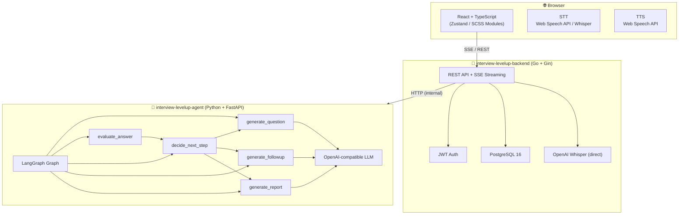

# 🎙️ Interview LevelUp

> AI 驱动的模拟面试平台 — 按岗位和级别进行全流程面试练习，获得实时评分与语音交互体验。

用户输入目标岗位和级别，AI 面试官便进入角色：逐轮提问、评估回答、在薄弱点深挖追问，最终给出结构化复盘报告。全程支持语音作答与朗读，尽量还原真实面试的紧张感。

---

## 仓库构成

| 仓库 | 职责 |
|---|---|
| [interview-levelup-backend](https://github.com/interview-levelup/interview-levelup-backend) | 🦫 Go + Gin REST API，用户认证、面试生命周期管理、SSE 推流 |
| [interview-levelup-agent](https://github.com/interview-levelup/interview-levelup-agent) | 🤖 Python + LangGraph AI 面试官，出题 / 评分 / 追问决策 |
| [interview-levelup-website](https://github.com/interview-levelup/interview-levelup-website) | 🎙️ React + TypeScript 前端，流式对话 UI、语音输入、TTS 朗读 |

---

## 系统架构



### 关键数据流

```
用户提交回答
    │
    ▼
backend  POST /interviews/:id/answer/stream
    │  写库记录答案
    ▼
agent  POST /chat/stream
    │  evaluate_answer → decide_next_step → generate_question
    │  SSE token ──────────────────────────► frontend 逐字渲染 + TTS 入队
    ▼
backend 收到 done 事件 → 持久化新问题 → 推 done 给前端
    ▼
frontend rounds 更新 → TTS 逐句朗读
```

---

## 核心功能

- **LangGraph 多节点 Agent** — 出题、评分、追问、反问检测、终止判断、最终报告，完整模拟真实面试官决策链路
- **实时流式对话** — SSE 推流 + 流式气泡渲染，面试官"边想边说"，切换时无闪烁
- **语音双向** — Web Speech API / OpenAI Whisper 语音输入；TTS 句子队列朗读（1.5× 速），不因新 token 到来中断
- **即时导航** — 新建面试时后端一创建 DB 行即推 `created` 事件，前端立刻跳转，首问在后台并行生成
- **评分复盘** — 每条回答附 0–100 分与多维评价详情，面试结束展示结构化总结报告
